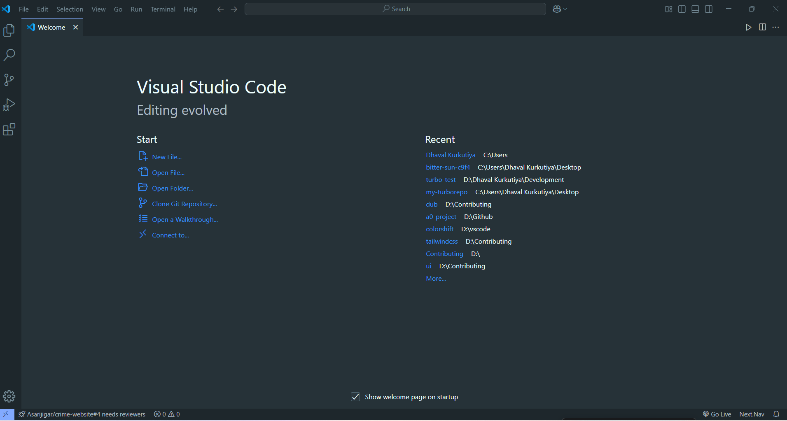

# ColorShift Material Pro

A comprehensive Material Design theme for Visual Studio Code that enhances your coding experience with carefully crafted colors and meticulous attention to UI details.



## Features

- **Complete UI Theming**: Every aspect of the VS Code interface has been themed for a consistent experience
- **Material Design Colors**: Based on Google's Material Design color palette for a modern, clean look
- **Enhanced Readability**: Carefully selected colors to reduce eye strain during long coding sessions
- **Syntax Highlighting**: Optimized for popular programming languages with distinct, meaningful color choices
- **Terminal Colors**: Beautiful terminal color scheme that matches the overall theme
- **🌟 Time-Based Color Shifting**: Automatically shifts between Morning, Standard, and Evening themes based on the time of day

## Time-Based Color Shifting

ColorShift Material Pro includes a unique feature that automatically adjusts your theme based on the time of day:

- **Morning Theme (6 AM - 6 PM)**: Brighter, more energetic colors to match your daytime workflow
- **Evening Theme (6 PM - 6 AM)**: Deeper, more relaxed colors that are easier on the eyes at night

To enable this feature:

1. Open the Command Palette (`Ctrl+Shift+P` or `Cmd+Shift+P`)
2. Type "ColorShift: Toggle Time-Based Color Shifting" and press Enter

You can customize the time ranges in your settings:

```json
"colorshift.morningStartHour": 6,  // Hour when morning theme begins (24-hour format)
"colorshift.eveningStartHour": 18  // Hour when evening theme begins (24-hour format)
```

## Installation

### VS Code Marketplace
1. Open **Extensions** in VS Code (`Ctrl+Shift+X` or `Cmd+Shift+X`)
2. Search for `ColorShift Material Pro`
3. Click **Install**
4. Select the theme via **File > Preferences > Color Theme** or `Ctrl+K Ctrl+T`

### Manual Installation
1. Download the `.vsix` file from the [releases page](https://github.com/colorshift/colorshift-material-pro/releases)
2. Run `code --install-extension colorshift-material-pro-x.x.x.vsix`
3. Select the theme via **File > Preferences > Color Theme** or `Ctrl+K Ctrl+T`

## Recommended Settings

For the best experience, we recommend the following settings:

```json
{
    "editor.fontFamily": "'Fira Code', 'Cascadia Code', Consolas, 'Courier New', monospace",
    "editor.fontLigatures": true,
    "editor.fontSize": 14,
    "editor.lineHeight": 24,
    "editor.letterSpacing": 0.5,
    "workbench.colorTheme": "ColorShift Material Pro"
}
```

## Customization

You can customize the theme by adding the following to your `settings.json`:

```json
"workbench.colorCustomizations": {
    "[ColorShift Material Pro]": {
        // Override theme colors here
    }
},
"editor.tokenColorCustomizations": {
    "[ColorShift Material Pro]": {
        // Override token colors here
    }
}
```

## Contributing

We welcome contributions! Please feel free to submit a Pull Request.

## License

This theme is released under the [MIT License](LICENSE).

## Credits

- Inspired by Material Design and other popular VS Code themes
- Created with ❤️ by the ColorShift Team